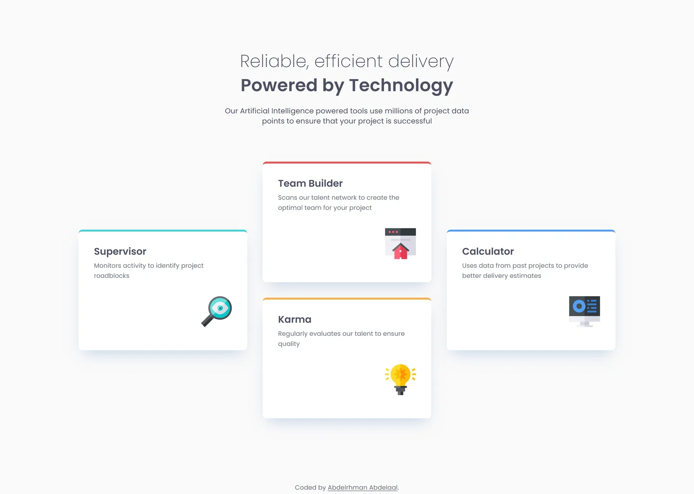

# Frontend Mentor - Four card feature section solution

This is a solution to the [Four card feature section challenge on Frontend Mentor](https://www.frontendmentor.io/challenges/four-card-feature-section-weK1eFYK). Frontend Mentor challenges help you improve your coding skills by building realistic projects.

## Table of contents

- [Overview](#overview)
  - [Screenshot](#screenshot)
  - [Links](#links)
- [My process](#my-process)
  - [Built with](#built-with)
  - [Design deviations](#design-deviations)
- [Author](#author)

## Overview

### Screenshot

### Links

- Solution URL: [GitHub](https://github.com/MrBlackvanta/Four-card-feature-section)
- Live Site URL: [Cloudflare](https://four-card-feature-section.abdelrhman-ahmed8881.workers.dev)

## My process

### Built with

- [Next.js 16](https://nextjs.org/) (App Router, React Compiler, Turbopack)
- [React 19](https://react.dev/)
- [TypeScript](https://www.typescriptlang.org/) (strict)
- [Tailwind CSS v4](https://tailwindcss.com/)

### Design deviations

**Every text pairing in this design passes WCAG as drawn, so no colour moved.** Measured
against the backdrop each string actually sits on: the heading and intro are 7.71:1 on
`#FAFAFA`, the card titles 8.04:1 on white, and the card descriptions 4.95:1 — the tightest
value on the page, with 0.45 of headroom. The card titles are held to the 4.5:1 normal-text
bar rather than 3:1, because they are weight 600 and axe only treats 700+ as bold.

**The four 4px accent bars fail non-text contrast and ship as drawn.** Against the card
white they measure Cyan 1.83, Orange 1.86, Blue 2.78, Red 3.56 — three of four under 3:1.
WCAG 1.4.11 covers UI components and graphical objects *required to understand the content*;
these bars carry no information, since each card's heading and description carry all of it.
The same applies to the four illustrations, which are decorative and `aria-hidden`.

**Six of the seven style-guide colours are rounded**, so the palette uses the paints from
the design file instead: Grey 500 is `#4D4F62` not `#4C4E61`, Grey 400 `#6A7178` not
`#6A7077`, Red `#EA5454` not `#EA5353`, Cyan `#44D3D2` not `#45D3D3`, Orange `#FCAE4A` not
`#FCAF4A`. Blue `#549EF2` is the only one that lands exactly. The page background `#FAFAFA`
is not in the style guide at all — it is the frame's own fill.

**Two line-heights in the design file are stale and were resolved from the design system.**
The desktop heading nodes report `100%` and the Supervisor card's description reports
`23px`, both contradicting the `Typography` presets. Dividing each node's box height by its
line count settles it — 50px over one 36px line is 1.4, and 42px over two 13px lines is 1.6,
matching the presets and the other three cards.

**The accent bar's width in the design file is wrong at mobile and tablet.** The rectangle
is 350px in all three frames while the card is 314px at those two, so in the file it
overhangs by 18px a side — an unresized leftover from the desktop layout. Frontend Mentor's
own render clips it: sampling `mobile-design.jpg` puts the cyan from x=31 to x=345, exactly
the card's span. It ships at the card's full width, drawn as a `border-top` so its corners
follow the card's 8px radius the way the design shows.

**The heading's letter-spacing stays in px.** The design specifies an absolute 0.25px at
both 36px and 24px, so expressing it as an em ratio would need two different tokens. Body
copy uses the ratio the rest of the scale shares, 0.00694em — 0.104px at 15px and 0.090px at
13px.

**The heading wraps below about 360px.** 24px Poppins needs 299px of advance for "Reliable,
efficient delivery" and a 320px viewport leaves 260px after the gutters. The design's
smallest frame is 375px, so nothing covers this. Both phrases wrap to two lines rather than
the heading shrinking, because the only size that fits at 320px is 20px — identical to the
card titles, which would read as a broken hierarchy rather than a smaller heading.

**Cards use a minimum height, not a fixed one.** They are exactly the design's 250px
whenever the descriptions run to two lines, which holds at every width from 320px up. A
fixed height would be immune to font-swap reflow but would clip at large text zoom, which is
a WCAG 1.4.4 failure that neither Lighthouse nor axe tests. The one visible consequence: at
320px two descriptions run to three lines, so those two cards are 255px rather than 250px.

**The desktop breakpoints are decisions — the design file has no frame between 768 and
1440.** The three-column pinwheel starts at 1024px, where the cards come out 300px wide with
236px of inner width and every description still on two lines. Verified against the case
that actually decides it: with a classic 15px scrollbar the media query still fires at 1024
while layout gets 1009, giving 295px cards and 231px inner — still two lines, against a
measured 227px requirement. The two-column layout therefore holds 768–1023 with its 660px
cap intact; letting the container grow instead would put 465px cards on screen at 1023, much
further from the design than wide gutters are.

**Desktop vertical padding is symmetric at 102px.** The design's 163px below the cards is
not a chosen value — it is `(1440 − 1114) / 2`, the horizontal gutter that falls out of
centring the card wrapper, with the frame height sized to the designer's screen.

**The attribution is pinned out of flow, so it costs no layout height.** It is not part of
the design, and in flow its ~23px pushed the document past `100dvh` and put a pointless
scrollbar on any screen shorter than 991px. Absolutely positioned against `<body>`, the
document height now equals the page's own content at every width and the scroll threshold is
969px — the design's own height. The mobile bottom padding is 80px rather than the 56px the
top uses, to leave the two-line attribution clearance now that it no longer pushes anything
down; mobile scrolls at every viewport anyway, so that costs nothing, and the one-screen
breakpoints keep the design's own padding.

**The mobile gutter is 30px, because the design disagrees with itself.** Its title block is
316px wide and its card wrapper 314px. 30px splits the difference: the cards land exactly and
the title block comes out 1px narrow.

**Nothing on this page moves, deliberately.** At desktop the entire design is one screen —
the design's own frame is 1029px and the card grid ends at 866px — so a scroll-driven reveal
would either never advance or animate content already painted. Only mobile scrolls enough
for one to run, and motion that exists on phones and nowhere else is worse than none. There
are no interactive controls beyond the two links in this footer, and the brief asks only for
the layout to respond to screen size, so there is no hover or press surface to animate
either. No reveal CSS, no scroll timelines, no reduced-motion block, because there is
nothing to gate.

## Author

- UpWork - [Abdelrhman Abdelaal](https://upwork.com/freelancers/~01f0a9479696b61f49)
- Frontend Mentor - [@MrBlackvanta](https://www.frontendmentor.io/profile/MrBlackvanta)
- LinkedIn - [Abdelrhman Abdelaal](https://www.linkedin.com/in/abdelrhman-vanta/)
